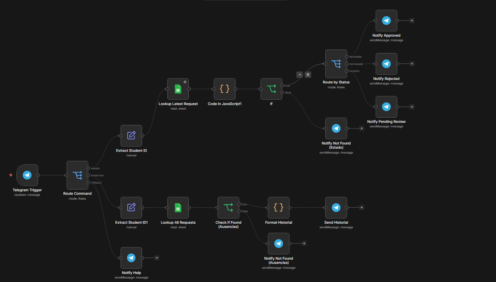
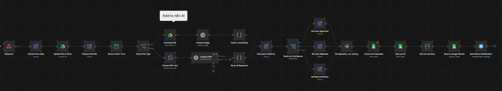

# 🎓 Sistema Automatizado de Justificación de Inasistencias

**Automatiza la recepción, análisis y clasificación de solicitudes de ausencia estudiantil usando IA**

---

## 📝 Descripción

Sistema web que permite a estudiantes enviar justificaciones de inasistencia. El sistema automáticamente:
- 📤 Recibe el formulario y archivo del estudiante
- 🤖 Analiza el documento con IA (OpenAI)
- ✅ Clasifica como: Válida, Inválida o Dudosa
- 📊 Registra en Google Sheets
- 📱 Notifica resultado por Telegram
- 📁 Almacena archivos en Google Drive

---

## 📌 Introducción

En el contexto educativo, la gestión de inasistencias suele ser un proceso manual que implica la revisión individual de formularios y documentos soporte por parte de un responsable. Este proceso puede ser:
- ⏱️ **Lento**: Revisión manual de cada solicitud
- 🔴 **Propenso a errores**: Inconsistencias en la evaluación
- 📈 **Difícil de escalar**: No se adapta a alto volumen

El presente proyecto propone el desarrollo de un **sistema automatizado** que permita gestionar, analizar y clasificar las justificaciones de inasistencia mediante:
- 🤖 Automatización de procesos (n8n)
- 🧠 Inteligencia artificial (OpenAI GPT-4o)
- ☁️ Almacenamiento en la nube (Google Drive/Sheets)
- 📱 Notificaciones en tiempo real (Telegram)

Esto optimiza tiempos de respuesta y reduce la carga operativa significativamente.

---

## 🎯 Objetivos

### Objetivo General
Desarrollar un sistema automatizado que permita registrar, analizar y gestionar solicitudes de justificación de inasistencias, integrando inteligencia artificial, almacenamiento en la nube y notificaciones en tiempo real.

### Objetivos Específicos
- ✅ **Diseñar un formulario web** para la recepción de solicitudes
- ✅ **Automatizar el almacenamiento** de datos en Google Sheets y Drive
- ✅ **Implementar análisis automático** mediante IA (OpenAI)
- ✅ **Clasificar solicitudes** en: Válida, Inválida, Dudosa
- ✅ **Integrar bot en Telegram** para consulta de estado en tiempo real
- ✅ **Reducir tiempo de respuesta** en la validación (de días a minutos)
- ✅ **Incorporar revisión manual** para casos ambiguos/dudosos
- ✅ **Generar auditoría completa** de decisiones tomadas

---

## 🎯 Visión General

Este proyecto implementa un **sistema automatizado end-to-end** para:

- ✅ Recibir solicitudes de justificación vía formulario web
- ✅ Almacenar archivos automáticamente en Google Drive
- ✅ Registrar datos en Google Sheets para análisis
- ✅ Analizar automáticamente con IA (OpenAI GPT-4o)
- ✅ Clasificar solicitudes (válida/inválida/dudosa)
- ✅ Notificar resultados por Telegram/Email
- ✅ Panel de métricas y reportes
- ✅ Sistema de revisión manual para casos dudosos

---

## � Flujo del Sistema





---

## 🚀 Cómo Comenzar

### Requisitos Previos
- Cuenta n8n
- Google Cloud Console (Drive + Sheets API)
- OpenAI API key
- Telegram Bot token

### Pasos de Configuración

#### 1. **Configurar Frontend**
```bash
# Edita app.js
const N8N_WEBHOOK = 'https://tu-webhook-url.com'

# Abre index.html en navegador (o sube a Netlify)
```

#### 2. **Crear Google Sheet**
```
Columnas necesarias:
- ID_Solicitud
- ID_Estudiante
- Nombre
- Correo
- Fecha_Envío
- Motivo
- URL_Archivo
- Clasificación_IA
- Confianza_%
- Estado
- Revisado_Por
- Fecha_Resolución
```

#### 3. **Configurar n8n Workflow**
```
1. Crear Webhook (POST)
2. Extract Form Data (validar datos)
3. Google Drive (upload archivo)
4. Detect File Type (PDF o Imagen)
5. OpenAI (análisis + clasificación)
6. Switch (router por confianza)
7. Google Sheets (append row)
8. Telegram (notificar)
9. Activar workflow
```

#### 4. **Configurar Credenciales**
- Google Drive OAuth2
- Google Sheets OAuth2
- OpenAI API
- Telegram Bot Token

#### 5. **Prueba**
```
1. Abre index.html
2. Completa formulario
3. Adjunta PDF/imagen
4. Click "Enviar"
5. Verifica resultado en Sheets + Telegram
```

---

## 📁 Estructura de Archivos

```
├── index.html       # Formulario web
├── app.js           # Lógica frontend
├── styles.css       # Diseño
├── config.js        # Configuración
└── README.md        # Este archivo
```

---

## 🎯 Criterios de Clasificación

**Válida** ✅
- Documento claro y legible
- Relacionado con la ausencia
- Nombres, fechas, sellos oficiales
- Ejemplo: Certificado médico, carta oficial

**Inválida** ❌
- No relacionado con la ausencia
- Ilegible o en blanco
- Ejemplo: Imagen genérica, documento vencido

**Dudosa** ⏳
- Parcialmente legible
- Información incompleta
- Requiere revisión manual
- Ejemplo: Foto borrosa, documento cortado

---

## 📊 Matriz de Decisión

| Confianza | Clasificación | Acción |
|-----------|---------------|--------|
| ≥90% | Válida | ✅ Auto-aprobado |
| 50-87% | Cualquiera | ⏳ Revisión manual |
| <50% | Cualquiera | ❌ Auto-rechazado |

---

## 🔧 Configuración de n8n

### Variables de Entrada Esperadas
```javascript
{
  name: "Juan García",
  email: "juan@uni.edu",
  student_id: "EST001",
  reason: "Médica",
  detail: "Consulta médica",
  submitted_at: "2024-01-15T10:30:00Z",
  filename: "certificado.pdf"
  // + archivo binario en $binary.file
}
```

### Outputs a Google Sheets
```javascript
{
  ID_Solicitud: "000001",
  ID_Estudiante: "EST001",
  Nombre: "Juan García",
  Correo: "juan@uni.edu",
  Clasificación_IA: "Válida",
  Confianza_%: 95,
  Estado: "Aprobada",
  URL_Archivo: "https://drive.google.com/...",
  Timestamp_Proceso: "2024-01-15 10:35:00"
}
```

---

## 📱 Comandos Telegram

```
/estado ID_ESTUDIANTE    → Consultar estado actual
/ausencias ID_ESTUDIANTE → Ver historial de solicitudes
/ayuda                   → Mostrar comandos disponibles
```

---
